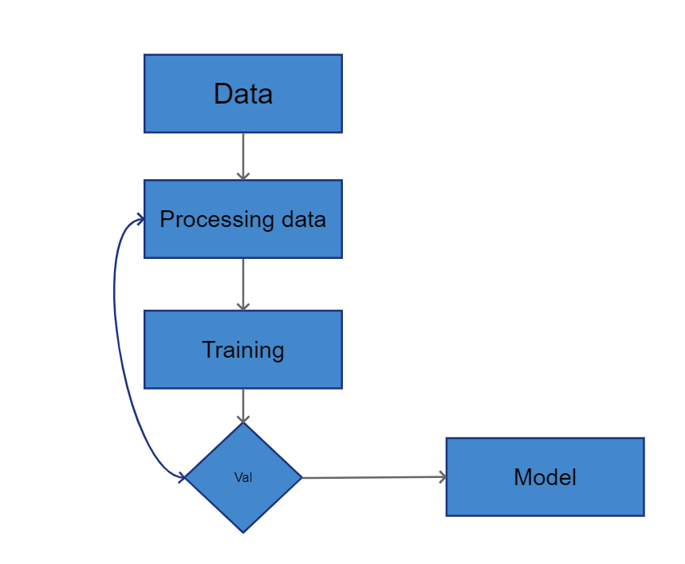
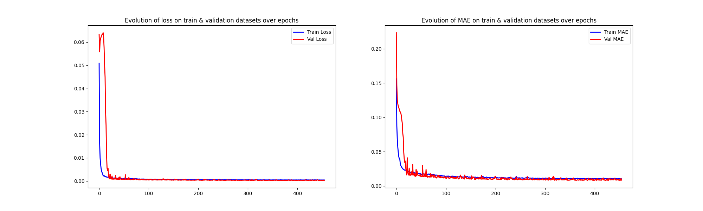
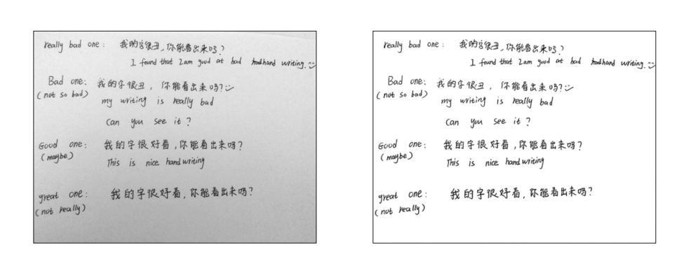
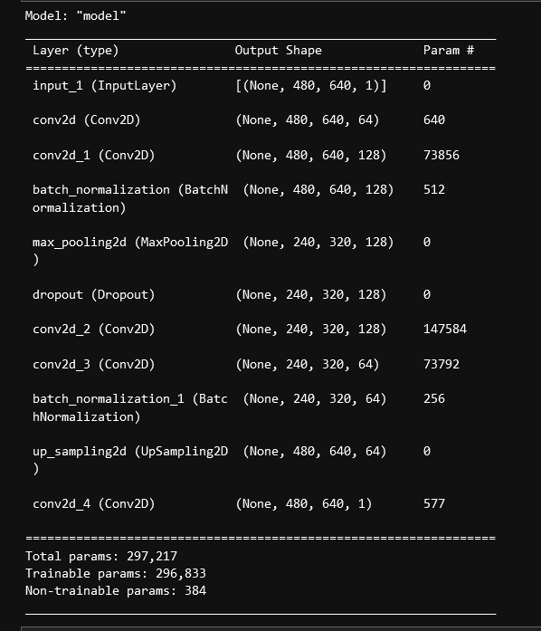

# Denoise images using Autoencoders

Xây dựng mô hình khử đi các nhiễu động có trong một bức ảnh dự vào mạng CNN.

Chuẩn bị một tập dữ liễu:
1. Trainning
2. Dữ liệu đã khử nhiễu.
3. Tập dữ liệu test.

### Traing dữ liệu


```bash
python train.py
```
Biểu đồ training cho kết quả như sau:


### test models sau training.
```bash
python test.py
```
Kết quả sau khi test:


### Cấu trúc mạng CNN:


## Tài liệu tham khảo tại:

1. https://www.kaggle.com/code/michalbrezk/denoise-images-using-autoencoders-tf-keras/notebook
